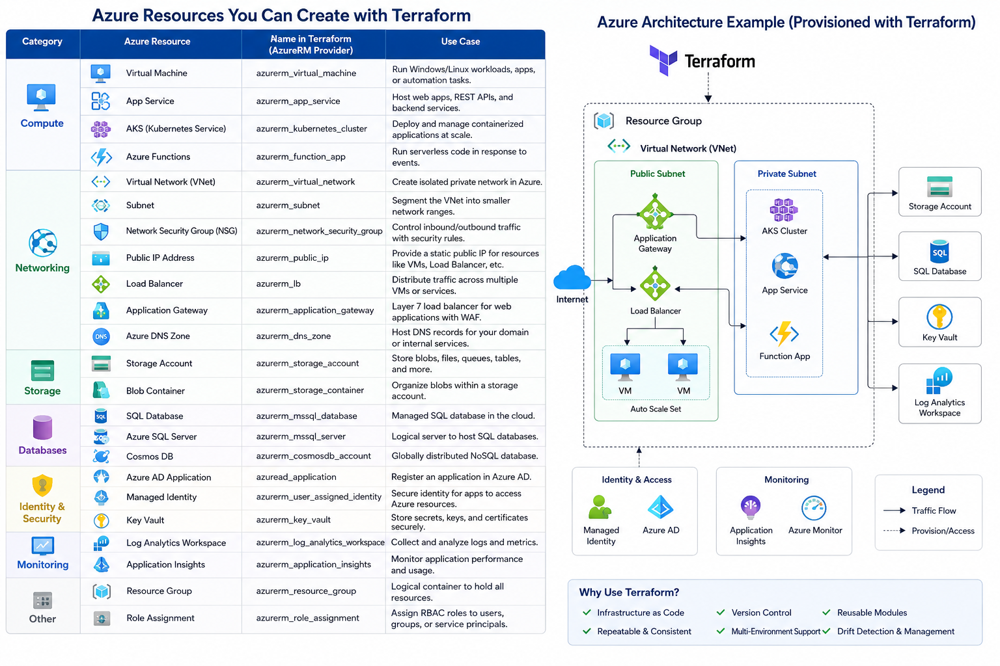
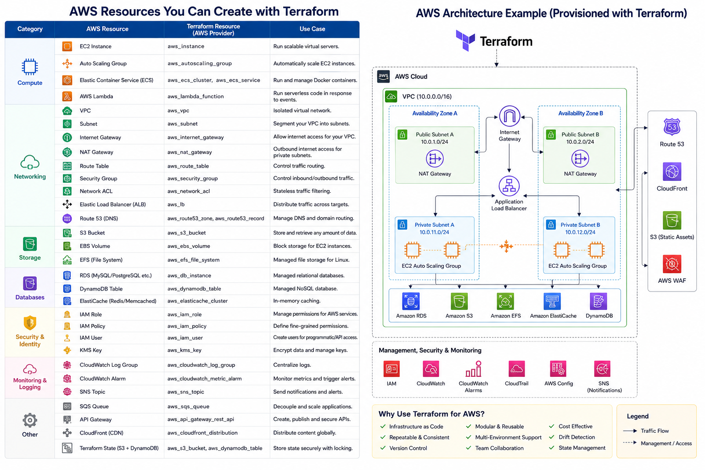
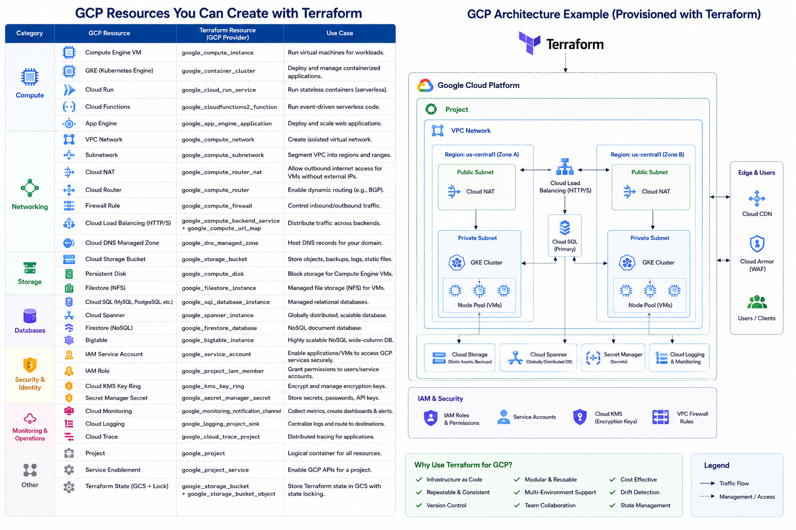
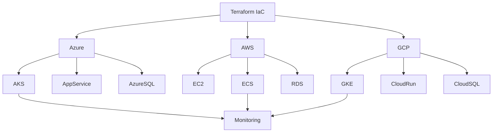

# Terraform Multi-Cloud Reference Architectures

  

Provisioning Azure, AWS, and Google Cloud infrastructure using Terraform

  
  
  
  
  

---

A professional reference repository demonstrating how Infrastructure as Code (IaC) can provision and manage resources across multiple cloud platforms using Terraform.

This repository contains:
- Azure architecture reference
- AWS architecture reference
- Google Cloud Platform (GCP) architecture reference
- Common Terraform-managed cloud resources
- Multi-cloud infrastructure examples
- DevOps and platform engineering concepts

---

# Cloud Platforms Covered

| Cloud Provider | Technologies |
|---|---|
| Microsoft Azure | Azure DevOps, AKS, App Services, VNets, Monitoring |
| Amazon Web Services (AWS) | EC2, VPC, ECS, RDS, IAM, CloudWatch |
| Google Cloud Platform (GCP) | GKE, Cloud Run, VPC, Cloud SQL, IAM |

---

# Architecture Diagrams

## Microsoft Azure

---

## Amazon Web Services (AWS)

---

## Google Cloud Platform (GCP)

---

# Key Terraform Concepts Demonstrated

- Infrastructure as Code (IaC)
- Cloud networking
- Kubernetes platforms
- CI/CD integration
- Cloud security concepts
- Monitoring and observability
- Modular infrastructure design
- Scalable architecture patterns
- Multi-cloud provisioning strategies

---

# Terraform Benefits

- Repeatable deployments
- Version-controlled infrastructure
- Reduced configuration drift
- Environment consistency
- Automated provisioning
- Improved operational reliability

---

# Technologies Referenced

## Azure
- Azure Virtual Machines
- Azure Kubernetes Service (AKS)
- Azure Monitor
- Azure App Gateway
- Azure DevOps

## AWS
- EC2
- ECS
- VPC
- RDS
- CloudWatch
- IAM

## GCP
- GKE
- Cloud Run
- Cloud SQL
- Cloud Monitoring
- IAM

---

# Multi-Cloud Terraform Architecture

# Ideal Use Cases

This repository is useful for:
- DevOps Engineers
- Cloud Engineers
- Platform Engineers
- Site Reliability Engineers (SREs)
- Infrastructure Architects
- Students learning Terraform
- Technical interview preparation

---

# Author

Created by Jimmy Lubega 
DevOps | Cloud Infrastructure | Terraform | Automation

